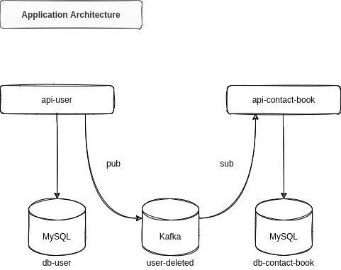

### Contact Book

Microservice oriented project created using java and spring boot to reinforce my knowledge.

#### How run the application

Inside the main folder execute this command:

	docker-compose up

#### API User

Open the browser and paste this URL: 
http://localhost:8081/contact-book/swagger-ui.html

#### API Contact Book

Open the browser and paste this URL: 
http://localhost:8082/contact-book/swagger-ui.html

#### Application Architecture 

